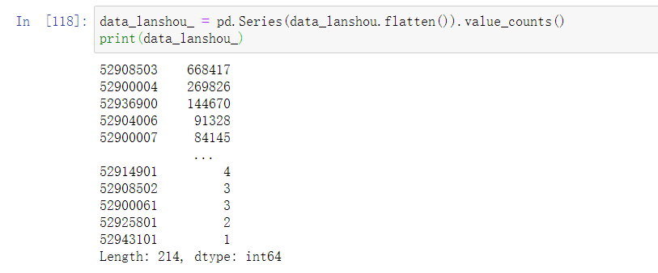

## 2020-10-20

将不需要的部门去除，并把所有的揽收投递数据按部门分组，并将分组放入列表中方便处理。验证不完整地址记录解析出的经纬度是否会相同。

- 城中村和CBD目前拟定以中心点和半径画圆作为辐射范围确定其面积，正在等待数据。
- 江门揽投数据分析业务说明中建议将地址数据不完整的记录暂时搁置，通过将某个道段中所有点构成的范围作为道段范围，在其中随机选择点作为数据不完整的记录。考虑到难度决定以矩形作为道段范围简化计算。

## 2020-10-19

读取江门揽投数据（包括日期），通过日期将江门周末的数据筛选掉。python中直接通过等号赋值实际上只是引用地址的传递，犯错了。

*由于其读取出来的数据中，日期的格式有(2020/8/1 12:57:00)或者(2020/8/22 13:22:00)，即日期长度不一致，不好通过对其切片进行筛选（否则得将两位数日子和一位数日子做不同长度的字符串切片来判断进行筛选），尝试了许多种方法之后发现pandas有一个to_datetime的方法可以将上面的日期格式转换成标准的timestamp对象。*

未出现在机构表中的那些机构及其数据是不需要考虑的，只处理机构表中给出的即可。

## 2020-10-18

一开始用机构名字分类，但是由于文件中的机构名不统一，有时使用缩写，有时使用全称，因此后来直接使用机构id进行揽投量统计检查。

揽收数据中有极多机构为52900004(计提标准及揽投量.xls中没有），52908503（在揽收地址数据中机构名是棠下，但是在计提标准和揽投量.xls文件中机构名为棠下的机构代码是52908504），即地址数据中的机构有大部分是计提标准及揽投量.xls中不包括的。可见下图，共有214个机构代码存储于揽收数据中，因此统计的结果是：计提标准及揽投量文件中的揽收投递总数目与实际给出的地址数据总数目不一致。

