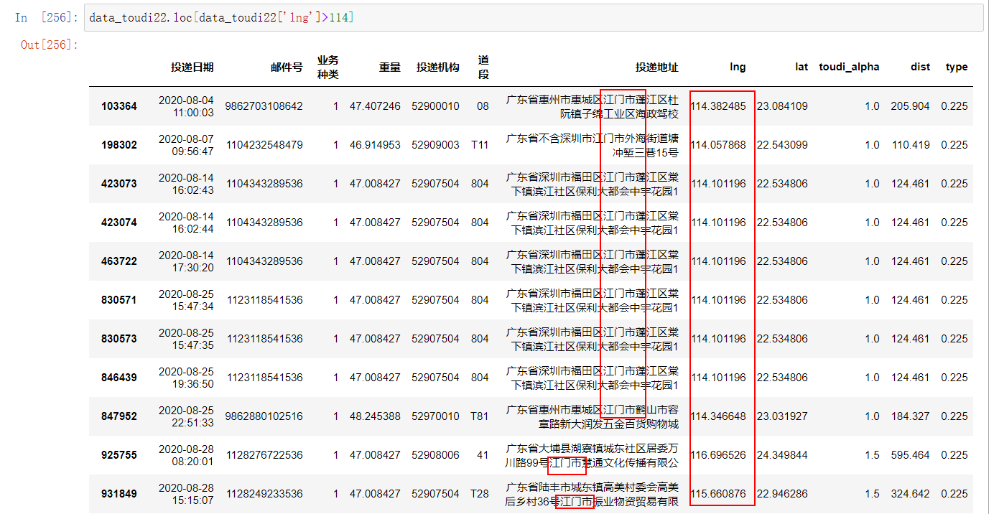
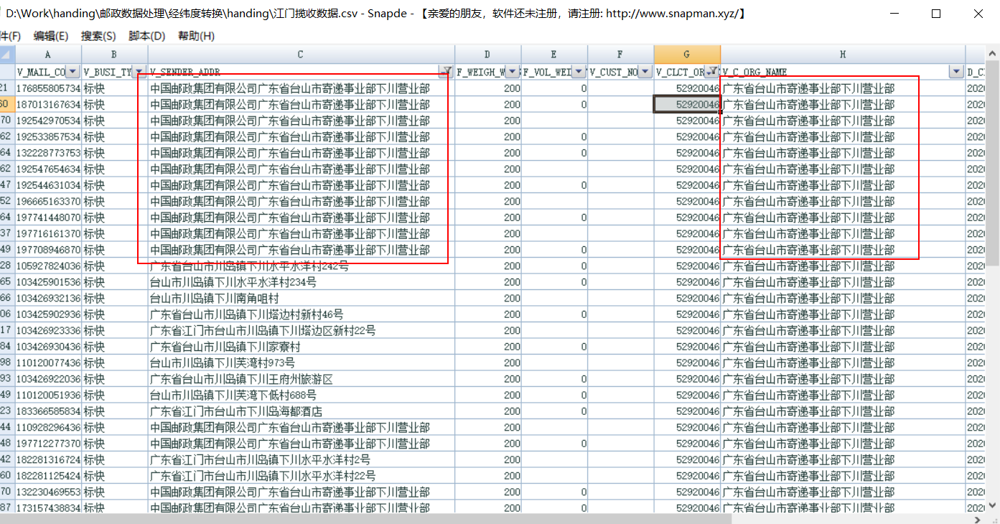
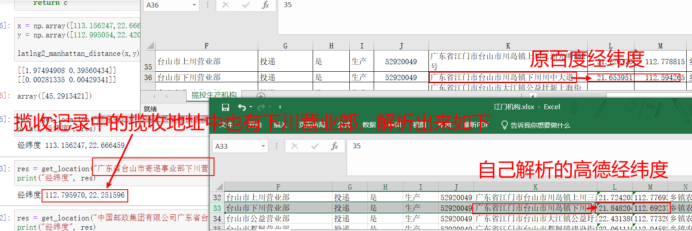
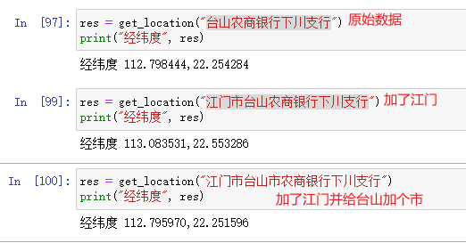
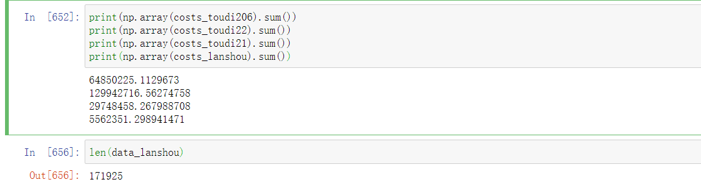
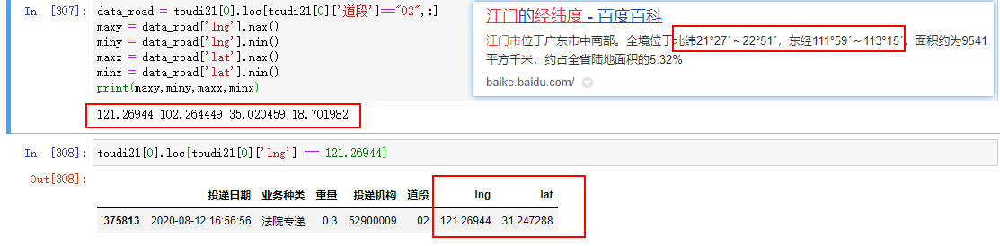

## 2020/11/06

无地址数据且无道段数据暂时用随机分布在处理的最后一个道段处理（总共360条）

最初解析的经纬度里有一部分时地址正确但是由于网路波动导致的经纬度空白记录，将其筛选出来进行补全

## 2020/11/05

填写数据量统计表，再次将江门市之外的地址的以及英文的地址数据整理出来，发送给邮局方面核实。

含空白地址和不完整地址解析出来的经纬度，将其按道段随机分布为其取经纬度。

## 2020/11/04

将邮政方面要求的揽投员id和道段全筛选出来，供其进行一一对应，做出揽投员id和道段的映射关系表，方便之后计算每个邮递员的日代价。

## 2020/11/03
会议中，决定了将系数更改为最新的权重，其次，计算代价的方法拟定为两种：
1.每次都从机构重新出发到An,Bn,Cn...,对每个同时同地的件进行累加代价（时间）
2.按经度由最东往西一路（经度一致则从北向南）计算
最后可能取两者均值

## 2020/11/02

在揽投部门的负荷之上，增加了个揽投部门的道段的负荷代价；由于揽收数据中没有道段，故而用揽投员id+姓名代替；生成两个文件，一个是揽收道段代价，一个是投递道段代价。

江门市经纬度(通过谷歌地图得到)

东经112-113.25; 北纬21.5-22.9

## 2020/11/01

将解析好的经纬度数据加入处理数据中，防止需求改变，暂时不修改原来的经纬度文件，只是在读取原有经纬度文件的基础之上，覆盖新的经纬度。

- 111.4以下113.3以上不覆盖
- 21.2以下22.9以上不覆盖

上述两者是在多次查看之后得到的结果，一般在这两个经纬度范围之外，都是出现了漏网之鱼，即昨天的解析结果里还会有漏选的，这种就不覆盖了。

## 2020/10/31

1.有杂糅地址（两个“市”以上的地址），筛选杂糅地址并去除特殊情况（如“环市”，“市场”），之后去最后一个市及其之后地址重新解析经纬度。



中招了，还有环市|超市|区市|道市|号市|市场|市政|市路|城市|[0-9a-zA-Z]市这些东西。重新筛选并且解析经纬度。


## 2020/10/30

揽收数据中有下川至下川（上川也有这个问题）的揽收记录，高德解析地址查出来的结果与机构表中经纬度有差异，故而代价会比较大。





```
应该是高德解析揽收地址中的“下川营业部”时具有较大误差
```


## 2020/10/29 

无“市”缺失地址的筛选，加上江门市进行解析

```
出现问题，若无脑加上江门市，有台山|开平|鹤山|恩平但没有市的地址解析会出问题
```




## 2020-10-23

按邮政方面的要求给代收和高端业务增加难度系数，按时间段（即每天的上下午各为一个时间段）筛选每个部门的数据，如果某个部门在一个时间段之内的一些投递地址（经纬度）一致，则去重并为其加上一个重复数量计数，无重复的均记为1。

粗略给出一个公式计算，结果有些奇怪，揽收的总代价特别低，明天仔细查看一下原因出在哪儿。



## 2020-10-22

求出重量的均值和标准差，对重量进行z-score归一化；去除外省数据以及缺失数据；按部门分别计算揽收投递数据距离存放在一个新的列中。

## 2020-10-21

三个投递数据，投递数据中对每个机构的每个道段进行矩形范围划分（只处理投递数据，因为只有投递数据有道段号这一属性），在其中随机选择点赋给该机构的该道段中无经纬度数据的记录。

测试过程中发现很多道段有其他省份的地址，因此划出来的道段区域很大，也就是说在其中随机取的点会分布在一个比较大的范围内，待处理。



## 2020-10-20

将不需要的部门去除，并把所有的揽收投递数据按部门分组，并将分组放入列表中方便处理。验证不完整地址记录解析出的经纬度是否会相同。

- 城中村和CBD目前拟定以中心点和半径画圆作为辐射范围确定其面积，正在等待数据。
- 江门揽投数据分析业务说明中建议将地址数据不完整的记录暂时搁置，通过将某个道段中所有点构成的范围作为道段范围，在其中随机选择点作为数据不完整的记录。考虑到难度决定以矩形作为道段范围简化计算。

## 2020-10-19

读取江门揽投数据（包括日期），通过日期将江门周末的数据筛选掉。python中直接通过等号赋值实际上只是引用地址的传递，犯错了。

*由于其读取出来的数据中，日期的格式有(2020/8/1 12:57:00)或者(2020/8/22 13:22:00)，即日期长度不一致，不好通过对其切片进行筛选（否则得将两位数日子和一位数日子做不同长度的字符串切片来判断进行筛选），尝试了许多种方法之后发现pandas有一个to_datetime的方法可以将上面的日期格式转换成标准的timestamp对象。*

未出现在机构表中的那些机构及其数据是不需要考虑的，只处理机构表中给出的即可。

## 2020-10-18

一开始用机构名字分类，但是由于文件中的机构名不统一，有时使用缩写，有时使用全称，因此后来直接使用机构id进行揽投量统计检查。

揽收数据中有极多机构为52900004(计提标准及揽投量.xls中没有），52908503（在揽收地址数据中机构名是棠下，但是在计提标准和揽投量.xls文件中机构名为棠下的机构代码是52908504），即地址数据中的机构有大部分是计提标准及揽投量.xls中不包括的。可见下图，共有214个机构代码存储于揽收数据中，因此统计的结果是：计提标准及揽投量文件中的揽收投递总数目与实际给出的地址数据总数目不一致。


